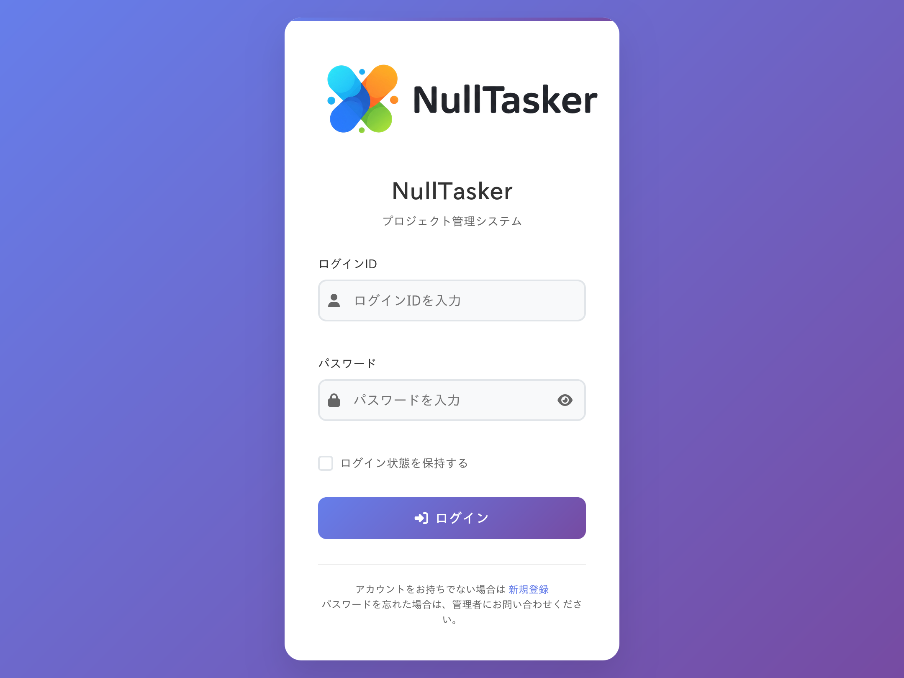
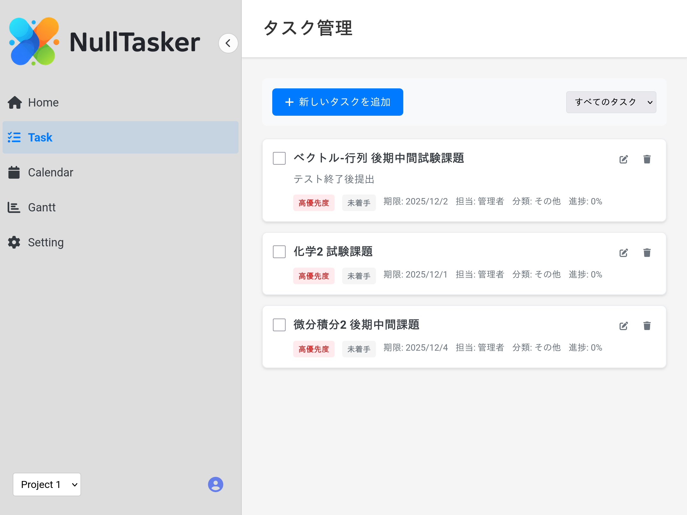
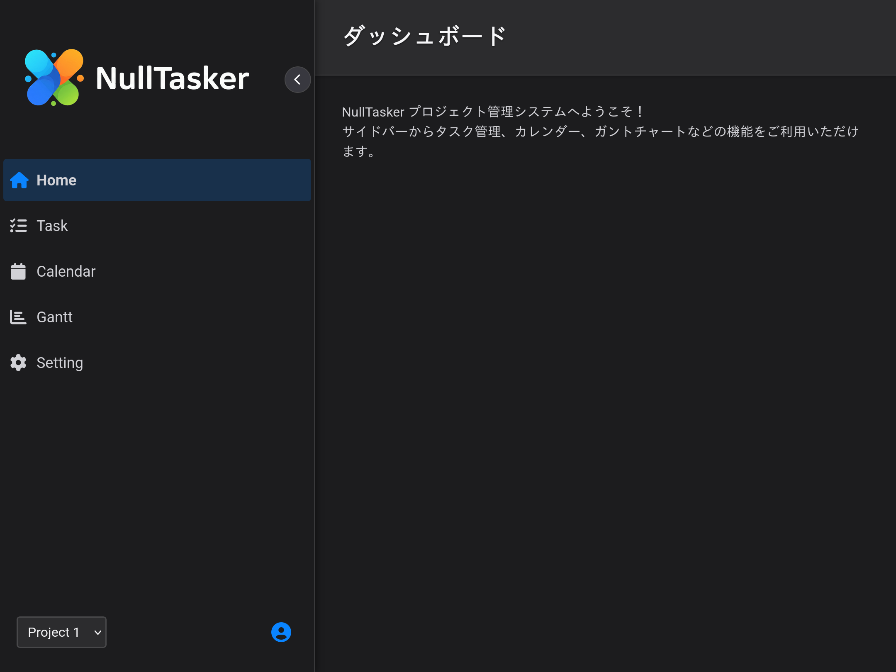

# リポジトリ

https://github.com/Team-Nullpo/NullTasker

# 概要

学内ハッカソンで作成した学生向けのタスク管理ツール。

5人グループで開発しました。

# 役割

- コードレビュワ
- レポジトリメンテナ
- デバッガ

# 技術スタック

## フロントエンド

HTML/CSS, JavaScript

## バックエンド

Node.js

## DB

sqlite

# ギャラリー

